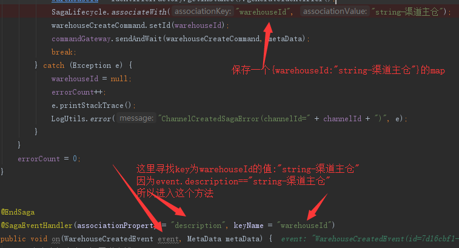

预习内容:
http://blog.didispace.com/microservice-three-problem-1/
http://blog.didispace.com/microservice-three-problem-2/
https://www.cnblogs.com/netfocus/p/4055346.html
http://www.uml.org.cn/zjjs/201609221.asp
实战:
http://edisonxu.com/2017/03/17/lean-and-ddd.html
http://edisonxu.com/2017/03/23/hello-cqrs.html
http://edisonxu.com/2017/03/30/hello-axon.html
http://edisonxu.com/2017/03/30/axon-jpa.html
http://edisonxu.com/2017/03/30/axon-event-sourcing.html
http://edisonxu.com/2017/03/30/axon-cqrs-example.html
http://edisonxu.com/2017/03/31/axon-saga.html
http://edisonxu.com/2017/04/01/axon-distribute.html
http://edisonxu.com/2017/04/24/axon-spring-cloud.html
资料:
https://github.com/AxonFramework/AxonFramework
http://www.axonframework.org/
https://docs.axonframework.org/

依赖
    // axon
    // compile group: 'org.axonframework', name: 'axon-distributed-commandbus-springcloud', version: "${axonFrameworkVersion}"
    compile group: 'org.axonframework', name: 'axon-spring-boot-starter', version: "${axonFrameworkVersion}"
//    compile group: 'org.axonframework', name: 'axon-amqp', version: "${axonFrameworkVersion}"
    compile group: 'org.axonframework', name: 'axon-mongo', version: "${axonFrameworkVersion}"

    // jackson 必须,axon序列化要用到
    compile group: 'com.fasterxml.jackson.datatype', name: 'jackson-datatype-jsr310', version: '2.9.5'

//    compile('org.springframework.cloud:spring-cloud-starter-config')
    implementation 'org.projectlombok:lombok:1.18.2'
//    compileOnly 'org.projectlombok:lombok:1.18.2'
// 打包的时候需要
//    annotationProcessor 'org.projectlombok:lombok:1.18.2'

命令侧的store配置(主要是配置一个EventStorageEngine跟一个SagaStore交给spring)
@Configuration
public class AxonCommonStoreConfig {

    private static final String HOST_PLACEHOLDER = "${spring.data.mongodb.command.host}";
    private static final String PORT_PLACEHOLDER = "${spring.data.mongodb.command.port}";
    private static final String USERNAME_PLACEHOLDER = "${spring.data.mongodb.command.username}";
    private static final String PWS_PLACEHOLDER = "${spring.data.mongodb.command.password}";
    private static final String DATABASE_PLACEHOLDER = "${spring.data.mongodb.command.database}";

    public MongoClient mongoClient(String host, int port, String username, String psw, String database) {
        // 暂时没有使用密码
//        MongoCredential credential = MongoCredential.createCredential(username, database, psw.toCharArray());
        ServerAddress serverAddress = new ServerAddress(host, port);
        MongoClient mongoClient = new MongoClient(serverAddress);
        return mongoClient;
    }

    public MongoTemplate axonMongoTemplate(String host, int port, String username, String psw, String database) {
        DefaultMongoTemplate template = new DefaultMongoTemplate(mongoClient(host, port, username, psw, database), database);
        return template;
    }

    @Bean
    @Primary
    public Serializer axonJsonSerializer() {
        return new JacksonSerializer();
    }

    @Bean
    public EventStorageEngine eventStorageEngine(Serializer axonJsonSerializer,
                                                 @Value(HOST_PLACEHOLDER) String host,
                                                 @Value(PORT_PLACEHOLDER) String port,
                                                 @Value(USERNAME_PLACEHOLDER) String username,
                                                 @Value(PWS_PLACEHOLDER) String password,
                                                 @Value(DATABASE_PLACEHOLDER) String database) {
        return new MongoEventStorageEngine(axonJsonSerializer, null, axonMongoTemplate(host, Integer.valueOf(port), username, password, database), new DocumentPerCommitStorageStrategy());
    }

    @Bean
    public SagaStore sagaStore(Serializer axonJsonSerializer,
                               @Value(HOST_PLACEHOLDER) String host,
                               @Value(PORT_PLACEHOLDER) int port,
                               @Value(USERNAME_PLACEHOLDER) String username,
                               @Value(PWS_PLACEHOLDER) String password,
                               @Value(DATABASE_PLACEHOLDER) String database) {
        return new MongoSagaStore(axonMongoTemplate(host, port, username, password, database),
                axonJsonSerializer);
    }
}

### saga

saga的start 跟end 没有事务原子性
saga负责在发出一个命令后,对当前聚合根有后续影响的时候使用,若无后续影响,则不使用
SagaLifecycle.end

聚合根(或事件)的字段已有数据不能删除,除非数据库里面的事件干净了

apply(event,metaData1).andThenApply(()->newGenericMessage<>(channelCreateSuccessEvent,metaData1));
同时发布两个事件

数据库里面 一个聚合根 只能有它自己的事件 不能存在别的聚合根的事件

saga开始后  到 第二个 handle接收前,全部业务都会存到同一个聚合跟

我的理解，觉得某个事务重要，需要跟踪整个过程，就用saga

当saga start 后 saga追踪整个过程,然后在saga end 把所有的事件都放入聚合根(如果操作涉及多个聚合根,则这些事件都放入最后一个聚合根中)即saga的事务性(每个handle都是一个完整的事务)

1.Saga并不会自动回滚,一切回滚都需要程序员手工编码
意向订单挂了,是因为注入了一个redisTemplate到聚合根里面导致的(事件发布了,但是不能创建快照)

