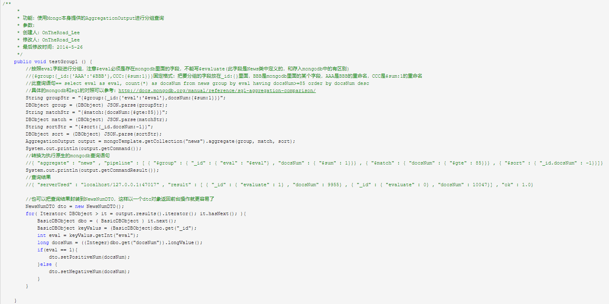
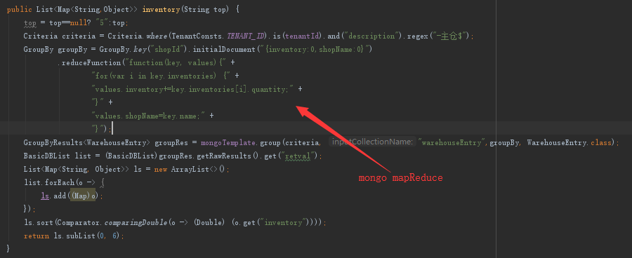

配置BigDecimal<-->Decimal128转换器
使用BigDecimal保存金额,若保存成字符串,则不能排序,mongodb4.0的Decimal128类型可以很好的支持
写入转换器,写的时候存入Decimal128类型
@WritingConverter
public class BigDecimalToDecimal128Converter implements Converter<BigDecimal, Decimal128> {

    @Override
    public Decimal128 convert(BigDecimal bigDecimal) {
        return new Decimal128(bigDecimal);
    }
}
读取转换器,转回BigDecimal
@ReadingConverter
public class Decimal128ToBigDecimalConverter implements Converter<Decimal128, BigDecimal> {

    @Override
    public BigDecimal convert(Decimal128 decimal128) {
        return decimal128.bigDecimalValue();
    }
}

Mongdb spring自动注入的额外配置,继承MongoDataAutoConfiguration,并把上述两个转换器加到里面
@Configuration
public class MongoConverterConfig extends MongoDataAutoConfiguration {

    public MongoConverterConfig(ApplicationContext applicationContext, MongoProperties properties) {
        super(applicationContext, properties);
        String ii = properties.getDatabase();
    }

Mongodb client自动注入配置,若没有这个会找不到client
@Configuration
public class MongoAutoConfig extends MongoAutoConfiguration {

    public MongoAutoConfig(MongoProperties properties, ObjectProvider<MongoClientOptions> options, Environment environment) {
        super(properties, options, environment);
    }
}

    @Override
    public MappingMongoConverter mappingMongoConverter(MongoDbFactory factory, MongoMappingContext context, BeanFactory beanFactory, CustomConversions conversions) {
        List<Object> list = new ArrayList<>();
        list.add(new BigDecimalToDecimal128Converter());
        list.add(new Decimal128ToBigDecimalConverter());
        return super.mappingMongoConverter(factory, context, beanFactory, new CustomConversions(list));
    }
}

mongodb存储文档若不显性设置id,id的格式会变成Object("生成的随机id") 显性设置后的格式是 生成的随机id

mongodb

创建数据目录
MongoDB将数据目录存储在 db 目录下。但是这个数据目录不会主动创建，我们在安装完成后需要创建它。请注意，数据目录应该放在根目录下（(如： C:\ 或者 D:\ 等 )。
在本教程中，我们已经在 C 盘安装了 mongodb，现在让我们创建一个 data 的目录然后在 data 目录里创建 db 目录。
命令行下运行 MongoDB 服务器
为了从命令提示符下运行 MongoDB 服务器，你必须从 MongoDB 目录的 bin 目录中执行 mongod.exe 文件。
C:\mongodb\bin\mongod --dbpath c:\data\db
如果执行成功，会输出如下信息：
2015-09-25T15:54:09.212+0800 I CONTROL  Hotfix KB2731284 or later update is not
installed, will zero-out data files
2015-09-25T15:54:09.229+0800 I JOURNAL  [initandlisten] journal dir=c:\data\db\j
ournal
2015-09-25T15:54:09.237+0800 I JOURNAL  [initandlisten] recover : no journal fil
es present, no recovery needed
2015-09-25T15:54:09.290+0800 I JOURNAL  [durability] Durability thread started
2015-09-25T15:54:09.294+0800 I CONTROL  [initandlisten] MongoDB starting : pid=2
488 port=27017 dbpath=c:\data\db 64-bit host=WIN-1VONBJOCE88
2015-09-25T15:54:09.296+0800 I CONTROL  [initandlisten] targetMinOS: Windows 7/W
indows Server 2008 R2
2015-09-25T15:54:09.298+0800 I CONTROL  [initandlisten] db version v3.0.6
……
连接MongoDB 
我们可以在命令窗口中运行 mongo.exe 命令即可连接上 MongoDB，执行如下命令：
C:\mongodb\bin\mongo.exe

配置 MongoDB 服务
管理员模式打开命令行窗口
创建目录，执行下面的语句来创建数据库和日志文件的目录
mkdir c:\data\db
mkdir c:\data\log
创建配置文件
创建一个配置文件。该文件必须设置 systemLog.path 参数，包括一些附加的配置选项更好。
例如，创建一个配置文件位于 C:\mongodb\mongod.cfg，其中指定 systemLog.path 和 storage.dbPath。具体配置内容如下：
systemLog:
    destination: file
    path: c:\data\log\mongod.log
storage:
    dbPath: c:\data\db
安装 MongoDB服务 
通过执行mongod.exe，使用--install选项来安装服务，使用--config选项来指定之前创建的配置文件。
C:\mongodb\bin\mongod.exe --config "C:\mongodb\mongod.cfg" --install
要使用备用 dbpath，可以在配置文件（例如：C:\mongodb\mongod.cfg）或命令行中通过 --dbpath 选项指定。
如果需要，您可以安装 mongod.exe 或 mongos.exe 的多个实例的服务。只需要通过使用 --serviceName 和 --serviceDisplayName 指定不同的实例名。只有当存在足够的系统资源和系统的设计需要这么做。
启动MongoDB服务
net start MongoDB
关闭MongoDB服务
net stop MongoDB
移除 MongoDB 服务
C:\mongodb\bin\mongod.exe --remove
	命令行下运行 MongoDB 服务器 和 配置 MongoDB 服务 任选一个方式启动就可以。
任选一个操作就好 

MongoDB 后台管理 Shell
如果你需要进入MongoDB后台管理，你需要先打开mongodb装目录的下的bin目录，然后执行mongo.exe文件，MongoDB Shell是MongoDB自带的交互式Javascript shell,用来对MongoDB进行操作和管理的交互式环境。
当你进入mongoDB后台后，它默认会链接到 test 文档（数据库）：
> mongo
MongoDB shell version: 3.0.6
connecting to: test
……
由于它是一个JavaScript shell，您可以运行一些简单的算术运算:
> 2 + 2
4
>
db 命令用于查看当前操作的文档（数据库）：
> db
test
>
插入一些简单的记录并查找它：
> db.runoob.insert({x:10})
WriteResult({ "nInserted" : 1 })
> db.runoob.find()
{ "_id" : ObjectId("5604ff74a274a611b0c990aa"), "x" : 10 }
>
第一个命令将数字 10 插入到 runoob 集合的 x 字段中

BasicDBObject basicDBObject=new BasicDBObject();
basicDBObject.put("full",false);
basicDBObject.put("sessionTime",newBasicDBObject("$gt",currentTime));
Query query=new BasicQuery(basicDBObject);
query.with(new Sort(Sort.Direction.DESC, "beginTime"));
Iterable<BatchEntry> batchs=mongoTemplate.find(query,BatchEntry.class);

BasicDBObject fieldsObject=new BasicDBObject();
DBObject dbObject=new BasicDBObject();
if(nendFields!=null&&nendFields.length>0){
for(String filed:nendFields){
fieldsObject.put(filed,true);
}
}
if(notNendFields!=null&&notNendFields.length>0){
for(String filed:notNendFields){
fieldsObject.put(filed,false);
}
}
Query query=new BasicQuery(dbObject,fieldsObject);
Return query;

QueryBuilder queryBuilder=new QueryBuilder();
queryBuilder.and("id").is(getTenantId());
BasicDBObject fieldsObject=new BasicDBObject();
fieldsObject.put("baseInfo.shopLogo",true);
BasicQuery basicQuery=new BasicQuery(queryBuilder.get(),fieldsObject);
SupplierEntry supplierEntry=mongoTemplate.findOne(basicQuery,SupplierEntry.class);

andAnyOf() 传入校验表达式(数组)
里面的表达式 用"或"连接

Any  可能表示任意一个符合后面的条件,则说明数据符合(上面:任意一个规格的barcode在有库存的codeList里面,则会在页面上显示)

@DBRef 注解使用
此注解放在查询侧实体的字段上,拥有此注解的字段会自动把相应实体查询出来
在命令侧中,与查询侧对应的字段类型为String , 存 id
(查询侧保存数据的时候,需要新建一个实体,然后把存的id塞进去)
@DBRef
Private UserLiteEntry user;

使用@Document(collection="userEntry")
关联一个拥有较少字段的类,过滤掉多余的字段

## 聚合
Aggregation aggregation=Aggregation.newAggregation(
Aggregation.match(criteria),
Aggregation.unwind("orderItems"),
Aggregation.group("shopId").sum("orderItems.quantity").as("saleCount"),
Aggregation.sort(newSort(Sort.Direction.DESC,"saleCount")),
Aggregation.skip(0l),
Aggregation.limit(Integer.valueOf(top))
);
AggregationResults<OrderEntry> aggRes=mongoTemplate.aggregate(aggregation,"orderEntry",OrderEntry.class);
BasicDBList list=(BasicDBList)aggRes.getRawResults().get("result");
Map map=new HashMap();
for(inti=0;i<list.size();i++){
BasicDBObject object=(BasicDBObject)list.get(i);
String id=object.get("_id").toString();
ShopEntry shopEntry=mongoTemplate.findOne(new Query(Criteria.where("id").is(id)),ShopEntry.class);
if(shopEntry!=null){
map.put(id,shopEntry.getShopName());
}
}

