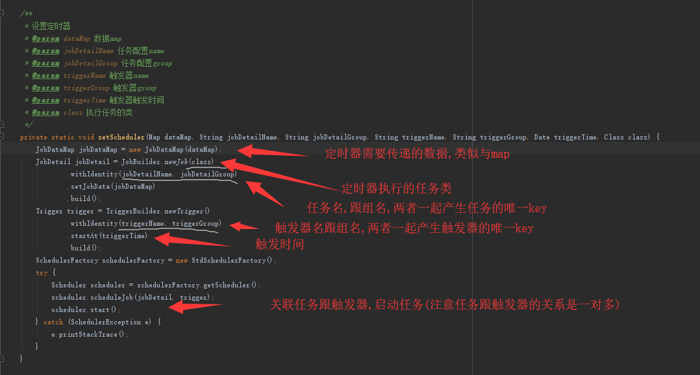
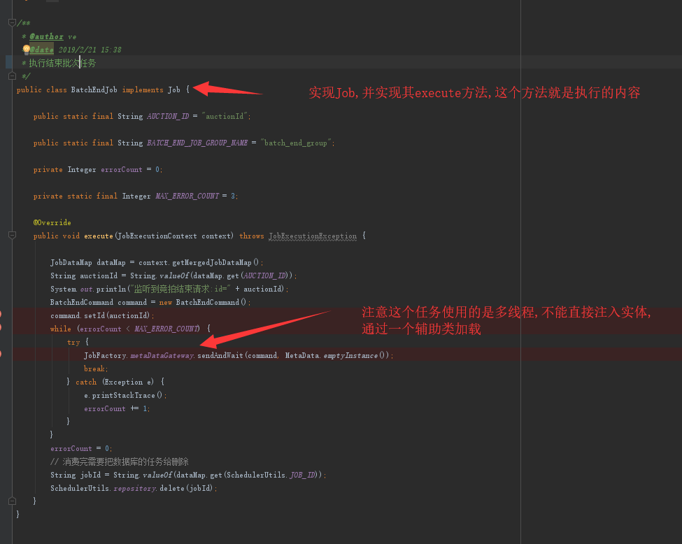
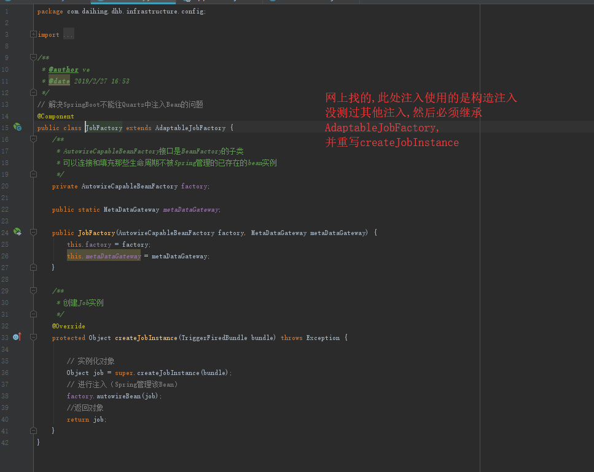

这个方法,如果系统重启,任务会丢失,所以需要持久化任务,持久化配置
持久化方案一(自己保存任务信息,启动时恢复)
1.创建任务的同时,把任务的基本信息,数据,保存到数据库
2.启动服务的时候,从数据库获取所有任务,重新加载 

Quartz使用quartz.properties作为配置文件
持久化方案二(使用别人封装好的mongodb-quartz)
引入mongodb-quartz的
配置如下
org.quartz.scheduler.instanceName: DefaultQuartzScheduler
org.quartz.scheduler.rmi.export: false
org.quartz.scheduler.rmi.proxy: false
org.quartz.scheduler.wrapJobExecutionInUserTransaction: false

org.quartz.threadPool.class: org.quartz.simpl.SimpleThreadPool
org.quartz.threadPool.threadCount: 10
org.quartz.threadPool.threadPriority: 5
org.quartz.threadPool.threadsInheritContextClassLoaderOfInitializingThread: true

org.quartz.jobStore.class: com.novemberain.quartz.mongodb.MongoDBJobStore
org.quartz.jobStore.mongoUri: mongodb://localhost:27017
org.quartz.jobStore.dbName: daihing_query
org.quartz.jobStore.collectionPrefix: quartz
org.quartz.jobStore.misfireThreshold: 60000

