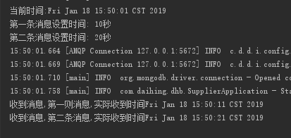
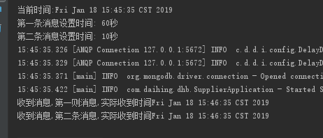
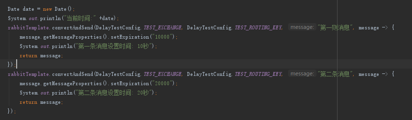
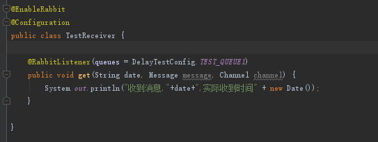

mq的队列命名,交换机命名,还有路由键的命名,很敏感
测试交换机命名:
aaaaa
aaaaa1 不可以
a.abc
b.abc 不可以
aa,bb
cd.gg 可以
延时队列(第一条队列)
死信队列(第二条队列,实时的)
1.延时队列不能有监听,若有监听且监听成功,消息就不会变成死信
2.延时队列第二条的TTL不能小于第一条
比如:第一条消息设置1000000,第二条消息设置100
第二条消息要等第一条消息的1000000毫秒之后,变成死信

