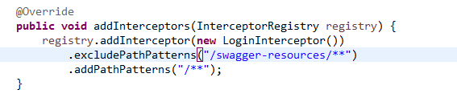
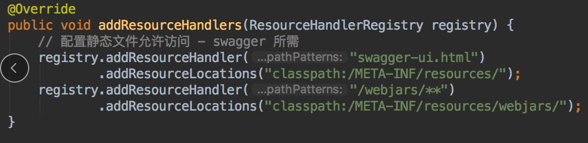
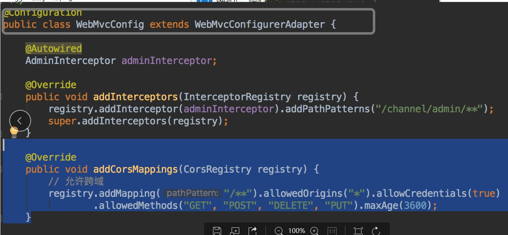

```
 创建配置类 SwaggerConfig
@Configuration
@EnableSwagger2
public class SwaggerConfig {
@Bean
    public Docket petApi() {
        return new Docket(DocumentationType.SWAGGER_2)
                .apiInfo(apiInfo())
                .select()
                .apis(RequestHandlerSelectors.basePackage("com.huitong")) //指定提供接口所在的基包
                .build();
    }
/**
     * 该套 API 说明，包含作者、简介、版本、host、服务URL
     * @return
     */
    private ApiInfo apiInfo() {
        return new ApiInfoBuilder()
                .title("demo api 说明")
                .contact(new Contact("allen","null","name@example.com"))
                .version("0.1")
                .termsOfServiceUrl("localhost:8080/demo1/")
                .description("demo api")
                .build();
    }
}
3 对接口和实体类添加注释，生成doc。常用的标记如下
@Api()用于类； 
标识这个类是swagger的资源
tags–表示分组说明标签
@ApiOperation()用于方法； 
表示一个http请求的操作
value用于方法描述 
notes用于提示内容
@ApiModel()用于实体类 
表示对类进行说明，用于参数用实体类接收

@ApiModelProperty()用于实体类字段 
表示对model属性的说明或者数据操作更改 
value–字段说明 
name–重写属性名字 
dataType–重写属性类型 
required–是否必填 
example–举例说明 
hidden–隐藏

@ApiImplicitParam() 用于 controller 方法 
表示单独的请求参数
name–参数ming 
value–参数说明 
dataType–数据类型 
paramType–参数类型 
example–举例说明
@ApiImplicitParams() 用于 controller 方法，包含多个 @ApiImplicitParam
@ApiIgnore()用于类或者方法上，可以不被swagger显示在页面上 
说明：简单的标记只需要@Api(tags="") 和 @ApiOperation(value="",notes="")
 更多关于 注解用法可以参考https://github.com/swagger-api/swagger-core/wiki/Annotations
http://localhost:8080/swagger-ui.html ，
在浏览器中输入 http://localhost:8080/doc.html 
swagger2依赖jstl跟spring-boot-starter-web
进不去可能是拦截器,可能是静态资源
进入swagger-ui.html且注入成功但是不显示方法 可能是下面这个路径配置错误
.apis(RequestHandlerSelectors.basePackage("cn.oa.controller"))此处的路径很重要!!!!!!

```


